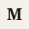

<p align="center">
  
</p>

<h1 align="center">The Morning Money</h1>

<p align="center">
  
  
</p>

Plain-English summaries of ASX announcements for the tickers you watch. Delivered every morning.

**Zero external accounts required.** `git clone && docker compose up` gives you a fully working app — local LLM, local email, local storage.

---

## Quick Start

```bash
git clone https://github.com/LachlanMartin/the-morning-money
cd the-morning-money
cp .env.example .env
docker compose up -d

# One-time setup:
docker compose exec app npx prisma migrate deploy
docker compose exec ollama ollama pull gemma3:12b
```

Open [localhost:3000](http://localhost:3000).

| Service | URL | Purpose |
|---------|-----|---------|
| App | http://localhost:3000 | Next.js UI |
| Prisma Studio | http://localhost:51212 | Database UI |
| Mailpit | http://localhost:8025 | Captures outbound email |
| Ollama | http://localhost:11434 | Local LLM API |

## Local Dev

**Prerequisites:** Node 20+, PostgreSQL 17 with pgvector, Ollama.

```bash
pnpm install
cp .env.example .env
ollama pull gemma3:12b
npx prisma migrate deploy
pnpm run dev
```

## Digest Pipeline

Fetches ASX announcements, analyses via Ollama, emails a summary. Runs weekdays at 10am AEST via cron sidecar.

```bash
./scripts/trigger-digest.sh
```

1. **Ingest** — fetch ASX announcements for watchlisted tickers, download PDFs
2. **Analyse** — send unprocessed PDFs to Ollama for summary + sentiment + direction
3. **Digest** — create `DigestRun` per active user with their tickers' analysis IDs
4. **Email** — send digest via SMTP (Mailpit by default)

Idempotent: announcements deduped by `sourceHash`, at most one email per user/day.

## Architecture

| Topic | Detail |
|-------|--------|
| **Auth** | Single-user, auto-created from `LOCAL_USER_EMAIL`. `proxy.ts` is a pass-through. |
| **Prisma 7** | `DIRECT_URL` for migrations, `DATABASE_URL` for runtime via `PrismaPg` adapter. |
| **Storage** | PDFs stored locally in `pdfs/`, keyed as `local://<filename>.pdf`. |
| **Cost** | LLM cost at O(announcements) — one analysis per announcement, not per user. |

## Commands

| Command | Description |
|---------|-------------|
| `pnpm run dev` | Next.js dev server (port 3000) |
| `pnpm run build` | `prisma generate && next build` |
| `pnpm run start` | Production server |
| `pnpm run lint` | ESLint |
| `pnpm run test` | Vitest unit tests |
| `pnpm run test:e2e` | Playwright e2e |
| `./scripts/trigger-digest.sh` | Run digest pipeline manually |
| `npx prisma migrate dev` | Create migration after schema change |
| `npx prisma generate` | Regenerate Prisma client |
| `npx prisma studio` | Database UI |

## Configuration

See `.env.example` for all variables.

| Variable | Default | Notes |
|----------|---------|-------|
| `LOCAL_USER_EMAIL` | `you@email.com` | Single user auto-created |
| `CRON_SECRET` | — | Shared secret for `/api/cron/daily-digest` |
| `OLLAMA_MODEL` | `gemma3:12b` | Swap for `mistral:7b`, `llama3.2:3b`, etc. |

## License

MIT — see [LICENSE](LICENSE).
