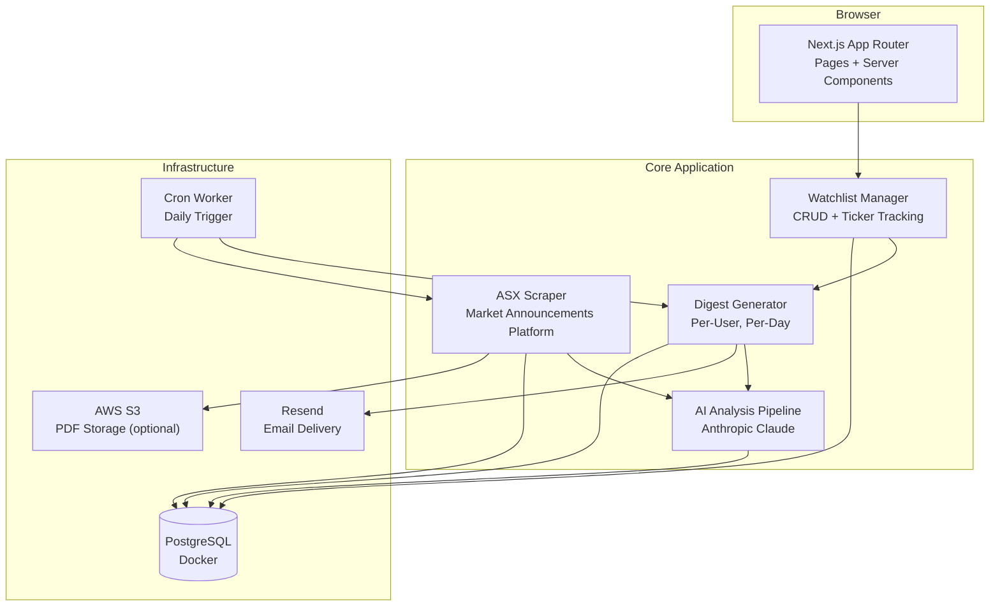

# The Morning Money

Plain-English summaries of ASX announcements for the tickers you watch. Delivered every morning.

Self-hosted, single-user, zero-auth. Clone, set two API keys, and run.

---

## Features

- **Watchlist Manager** — create watchlists, add/remove ASX tickers (e.g. BHP, CBA, TLS)
- **Announcement Ingestion** — scrapes ASX Market Announcements Platform for today's PDFs
- **AI Analysis** — per-announcement summaries via Anthropic Claude
- **Daily Digest** — morning email of analysed announcements via Resend

## Tech Stack

| Layer     | Choice                      |
| --------- | --------------------------- |
| Framework | Next.js 16 (App Router)     |
| Language  | TypeScript (strict)         |
| Styling   | Tailwind CSS v4, shadcn/ui  |
| Database  | PostgreSQL + Prisma 7       |
| AI        | Anthropic Claude            |
| Email     | Resend                      |
| Storage   | AWS S3 (optional)           |

## Architecture

### Data Flow



### Key Design Decisions

- **Per-announcement analysis, not per-user**: announcements are analysed once per ticker (O(announcements) cost, not O(users)). All watchers of a ticker share the same analysis.
- **AFSL-compliant**: analysis is general information + sentiment only, never personalised advice. No user portfolio context is fed to the model.
- **Single-user**: the app auto-creates one local user from `LOCAL_USER_EMAIL`. No signups, no logins, no session management.

## Getting Started

### Quick Start (Docker)

```bash
git clone https://github.com/LachlanMartin/the-morning-money
cd the-morning-money
cp .env.example .env   # fill in your API keys

docker compose up -d   # starts Postgres + the app
```

The app will be available at [localhost:3000](http://localhost:3000).

Run database migrations the first time:

```bash
docker compose exec app npx prisma migrate deploy
```

### Local Development (without Docker)

#### Prerequisites

- Node.js 20+
- PostgreSQL 17 with pgvector
- Anthropic API key (for AI analysis)
- Resend API key (for email digests)

#### Setup

```bash
git clone https://github.com/LachlanMartin/the-morning-money
cd the-morning-money
npm install
cp .env.example .env
```

Edit `.env` with your API keys and database URL, then:

```bash
npx prisma migrate deploy
npm run dev
```

Open [localhost:3000](http://localhost:3000) — you're ready to create watchlists and add tickers.

### Commands

| Command                  | Description                           |
| ------------------------ | ------------------------------------- |
| `npm run dev`            | Start Next.js dev server              |
| `npm run build`          | Production build                      |
| `npm run start`          | Start production server               |
| `npm run lint`           | Run ESLint                            |
| `npm run test`           | Run unit tests                        |
| `npm run test:e2e`       | Run Playwright e2e tests              |
| `npx prisma migrate dev` | Create migration after schema changes |
| `npx prisma generate`    | Regenerate Prisma client              |
| `npx prisma studio`      | Open database UI                      |

## Self-Hosting

The app runs on any Node.js platform with a Postgres database.

### Required Services

| Service          | Purpose             | Free Tier Available  |
| ---------------- | ------------------- | -------------------- |
| PostgreSQL       | Database            | Self-hosted          |
| Anthropic Claude | AI analysis         | No (paid API)        |
| Resend           | Email delivery      | Yes (100 emails/day) |

### Env Vars

| Variable              | Required | Notes                                   |
| --------------------- | -------- | --------------------------------------- |
| `LOCAL_USER_EMAIL`    | Yes      | Email for the single auto-created user  |
| `DATABASE_URL`        | Yes      | Postgres connection (pooled)            |
| `DIRECT_URL`          | Yes      | Postgres connection (direct, migrations)|
| `ANTHROPIC_API_KEY`   | Yes      | Claude API key for AI analysis          |
| `RESEND_API_KEY`      | Yes      | Resend API key for email delivery       |
| `RESEND_FROM_ADDRESS` | Yes      | Sender address for digest emails        |
| `CRON_SECRET`         | Yes      | Shared secret for cron endpoint         |
| `AWS_*`               | No       | S3 bucket for PDF storage (falls back to direct URLs) |

## License

MIT — see [LICENSE](LICENSE).
