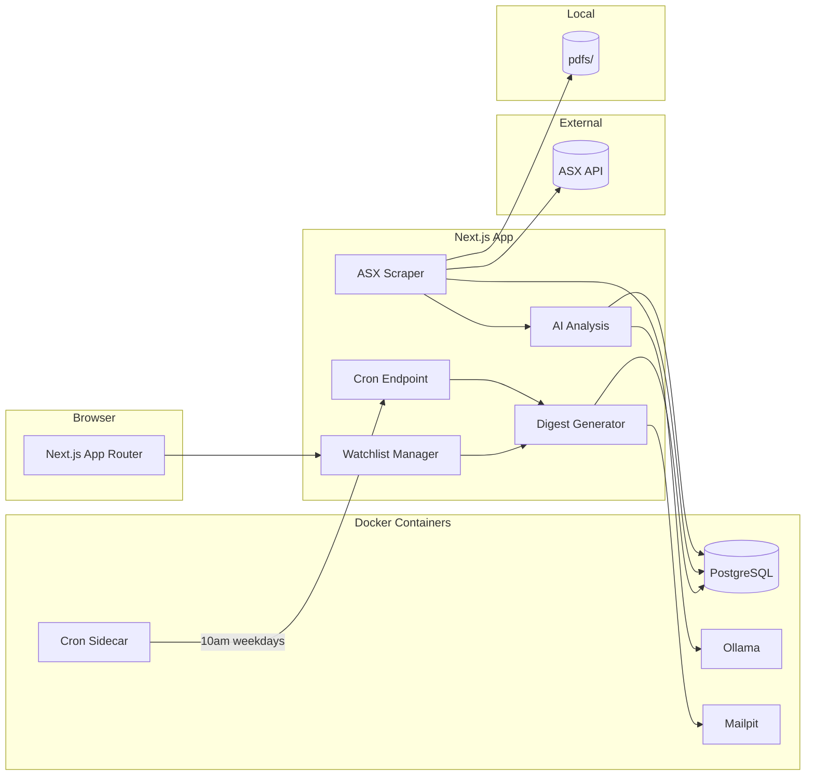

# The Morning Money

Plain-English summaries of ASX announcements for the tickers you watch. Delivered every morning.

**Zero external accounts required.** `git clone && docker compose up` gives you a fully working app — local LLM, local email, local storage.

---

## Features

- **Watchlist Manager** — create watchlists, add/remove ASX tickers (e.g. BHP, CBA, TLS)
- **Announcement Ingestion** — scrapes ASX Market Announcements Platform for today's PDFs
- **AI Analysis** — per-announcement summaries via local LLM (Ollama)
- **Daily Digest** — morning email of analysed announcements via SMTP (Mailpit by default)

## Tech Stack

| Layer     | Choice                     |
| --------- | -------------------------- |
| Framework | Next.js 16 (App Router)    |
| Language  | TypeScript (strict)        |
| Styling   | Tailwind CSS v4, shadcn/ui |
| Database  | PostgreSQL + Prisma 7      |
| AI        | Ollama (local LLM)         |
| Email     | Nodemailer + SMTP          |
| Storage   | Local filesystem           |

## Architecture



## Getting Started

### Quick Start (Docker)

```bash
git clone https://github.com/LachlanMartin/the-morning-money
cd the-morning-money
cp .env.example .env

docker compose up -d   # starts Postgres + Ollama + Mailpit + the app
```

Run database migrations and pull the LLM model (one-time):

```bash
docker compose exec app npx prisma migrate deploy
docker compose exec ollama ollama pull gemma3:12b
```

The app will be available at [localhost:3000](http://localhost:3000).

### Services

| Service       | URL                    | Purpose                           |
| ------------- | ---------------------- | --------------------------------- |
| App           | http://localhost:3000  | Next.js                           |
| Prisma Studio | http://localhost:51212 | Database UI (`npx prisma studio`) |
| Mailpit       | http://localhost:8025  | Email capture + web UI            |
| Ollama        | http://localhost:11434 | Local LLM API                     |
| Cron          | —                      | Scheduler sidecar (see below)     |

### Local Development (without Docker)

**Prerequisites:** Node.js 20+, PostgreSQL 17 with pgvector, Ollama

```bash
git clone https://github.com/LachlanMartin/the-morning-money
cd the-morning-money
pnpm install
cp .env.example .env

# Edit .env with your database URL and Ollama endpoint
# Defaults: OLLAMA_BASE_URL=http://localhost:11434, OLLAMA_MODEL=gemma3:12b

ollama pull gemma3:12b   # pull the model once
npx prisma migrate deploy
pnpm run dev
```

### Commands

| Command                       | Description                            |
| ----------------------------- | -------------------------------------- |
| `pnpm run dev`                | Start Next.js dev server               |
| `pnpm run build`              | Production build                       |
| `pnpm run start`              | Start production server                |
| `pnpm run lint`               | Run ESLint                             |
| `pnpm run test`               | Run unit tests                         |
| `pnpm run test:e2e`           | Run Playwright e2e tests               |
| `./scripts/trigger-digest.sh` | Run the daily digest pipeline manually |
| `npx prisma migrate dev`      | Create migration after schema changes  |
| `npx prisma generate`         | Regenerate Prisma client               |
| `npx prisma studio`           | Open database UI                       |

## Daily Digest Pipeline

The app runs a daily pipeline that scrapes ASX announcements, analyses them with Ollama, and emails a summary digest.

### Automatic (Docker)

A `cron` sidecar container runs the pipeline at **10:00am AEST on trading days** (Mon–Fri). It curls the app's internal endpoint with the `CRON_SECRET`.

```bash
docker compose up -d   # includes the cron container
docker compose logs cron  # view run history
```

### Manual

For local dev or testing, trigger the pipeline on-demand:

```bash
./scripts/trigger-digest.sh
```

### Pipeline steps

1. **Ingest** — fetches today's ASX announcements for all watchlisted tickers, downloads PDFs, stores locally in `pdfs/`
2. **Analyse** — sends unprocessed PDFs to Ollama for AI summary + sentiment + direction
3. **Digest** — generates a `DigestRun` per active user containing their tickers' analysis IDs
4. **Email** — sends the digest email via SMTP (Mailpit by default)

Idempotency guarantees:

- Announcements deduplicated by `sourceHash` — re-runs skip existing
- `DigestRun(userId, date)` is unique — email sent at most once per user/day

## Configuration

### Required Env Vars

| Variable           | Default         | Notes                           |
| ------------------ | --------------- | ------------------------------- |
| `LOCAL_USER_EMAIL` | `you@email.com` | Auto-created single user        |
| `DATABASE_URL`     | —               | Postgres connection (pooled)    |
| `DIRECT_URL`       | —               | Postgres connection (direct)    |
| `CRON_SECRET`      | —               | Shared secret for cron endpoint |

### Optional Env Vars

| Variable          | Default                           | Notes                                  |
| ----------------- | --------------------------------- | -------------------------------------- |
| `OLLAMA_BASE_URL` | `http://ollama:11434`             | Ollama API endpoint                    |
| `OLLAMA_MODEL`    | `gemma3:12b`                      | Model to use (mistral:7b, llama3.2:3b) |
| `SMTP_HOST`       | `mailpit`                         | SMTP server host                       |
| `SMTP_PORT`       | `1025`                            | SMTP server port                       |
| `SMTP_SECURE`     | `false`                           | Use TLS (`true` for port 465)          |
| `SMTP_USER`       | —                                 | SMTP auth user                         |
| `SMTP_PASS`       | —                                 | SMTP auth password                     |
| `SMTP_FROM`       | `Morning Money <daily@localhost>` | Sender address                         |

### Real Email Delivery

To send real emails instead of capturing in Mailpit, swap the SMTP vars to your provider:

```env
# Gmail example
SMTP_HOST=smtp.gmail.com
SMTP_PORT=587
SMTP_USER=you@gmail.com
SMTP_PASS=<app-password>
SMTP_FROM=Morning Money <you@gmail.com>
```

### Model Options by Hardware

| Model         | Size | VRAM needed |
| ------------- | ---- | ----------- |
| `llama3.2:3b` | ~2GB | CPU-able    |
| `mistral:7b`  | ~4GB | 4-6GB       |
| `gemma3:12b`  | ~8GB | 8-10GB      |

Set via `OLLAMA_MODEL` in `.env`.

## License

MIT — see [LICENSE](LICENSE).
